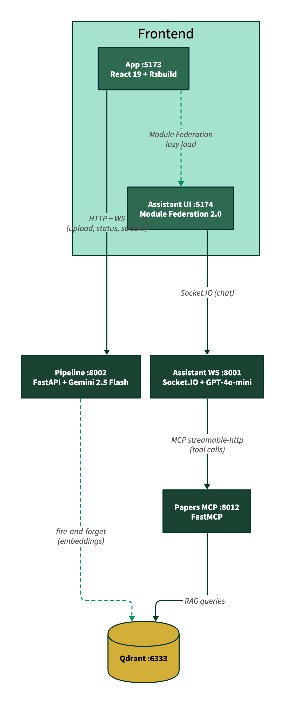
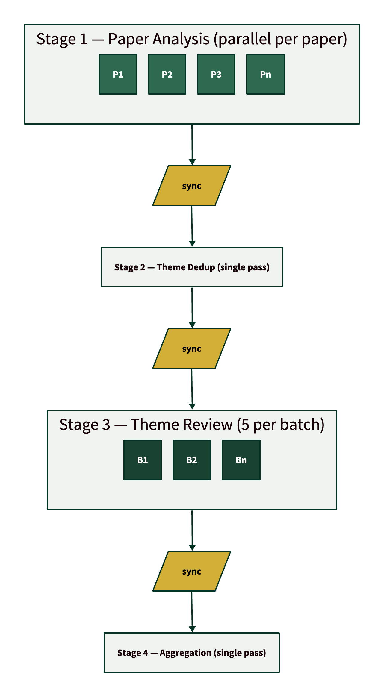
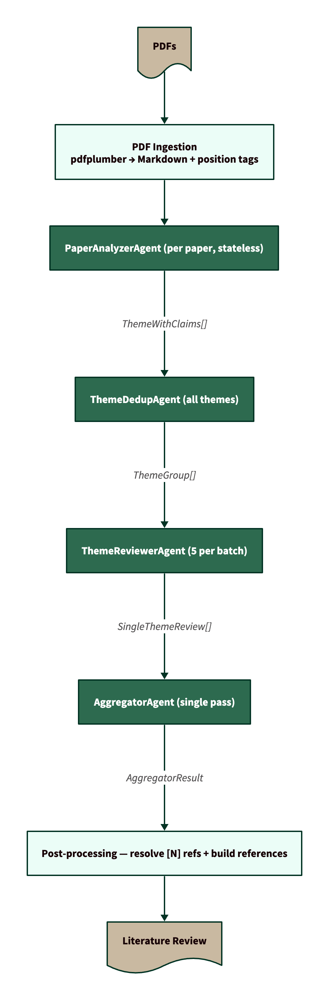
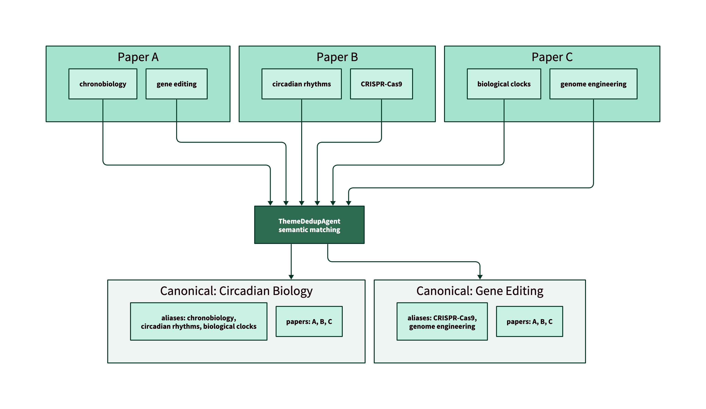
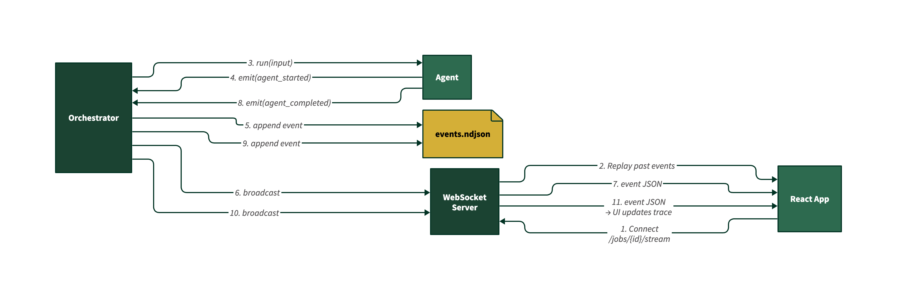
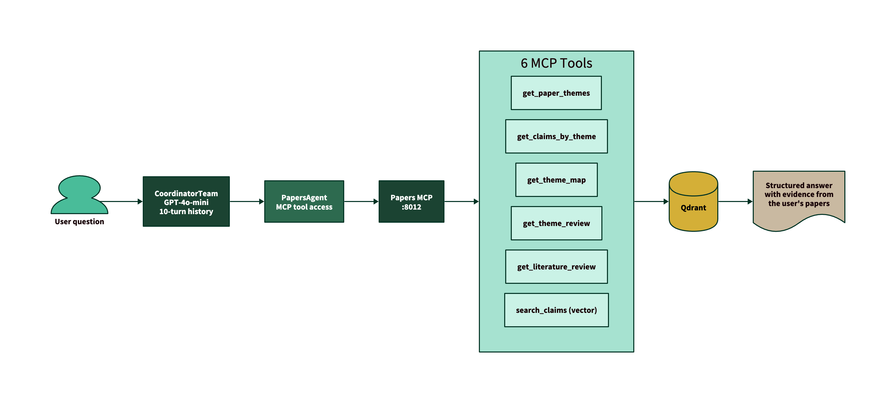
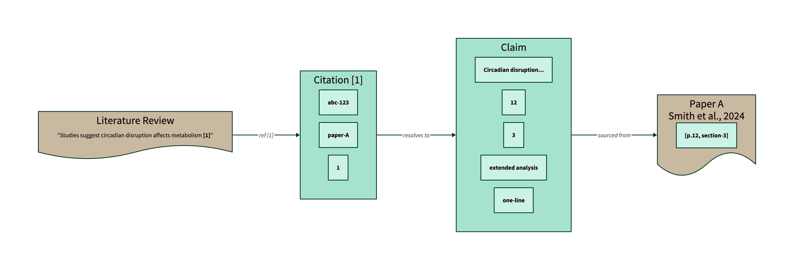

# The Saurus — Architecture

A multi-agent pipeline that transforms a corpus of scientific PDFs into a comprehensive literature review with thematic analysis and traceable citations.

## System Overview



| Service | Tech | Role |
|---------|------|------|
| **App** :5173 | React 19, Rsbuild, Tailwind v4 | Host UI — upload, trace, review |
| **Assistant UI** :5174 | React 19, Module Federation 2.0 | Federated chat panel (lazy-loaded) |
| **Pipeline** :8002 | FastAPI, Gemini 2.5 Flash | PDF ingestion + multi-agent orchestrator |
| **Assistant WS** :8001 | FastAPI, Socket.IO, GPT-4o-mini | Conversational agent with MCP tools |
| **Papers MCP** :8012 | FastMCP | RAG bridge — 6 tools over Qdrant |
| **Qdrant** :6333 | Qdrant (Docker) | Vector search for claims + themes |

Key decisions:
- **YAML as MVP persistence** — Qdrant writes are graceful side-effects; pipeline works without it
- **Module Federation 2.0** — Assistant UI is a separate build, lazy-loaded with error boundaries
- **MCP as data bridge** — Clean separation between pipeline (writes) and assistant (reads)

## Pipeline Flow

Four stages with explicit sync barriers and controlled parallelism.



All LLM calls are throttled by a shared `asyncio.Semaphore` (configurable via `PIPELINE_LLM_MAX_CONCURRENT`, default 2 for free tier, 10+ for paid).

## Agent Data Flow

What each agent receives and produces as data accumulates through the pipeline.



### Critical Design Decision: Stateless Paper Analysis

Each paper is analyzed **independently** — no accumulated context from prior papers is passed to the agent. This prevents cross-paper bias where themes found in Paper 1 would prime the extraction in Paper 2.

Theme synonyms (e.g., "chronobiology" in Paper A vs "circadian rhythms" in Paper B) are resolved downstream by the **ThemeDedupAgent**, which sees all themes at once and groups them semantically.

## Theme Deduplication

The core challenge: different papers use different terminology for the same concept.



Output: a **theme map** — `{canonical_id → [source_theme_ids]}` — that unifies all downstream processing under canonical names.

## Persistence Model (MVP)

Filesystem-based for rapid prototyping and debuggability. In production, this layer would be backed by a proper database (e.g., PostgreSQL for structured state, S3 for artifacts) — the persistence interface is isolated in `core/persistence.py`, making the swap straightforward.

```
jobs/{job_id}/
├── status.yaml                    # JobStatus (state, stage, progress)
├── papers.yaml                    # list[PaperEntry] (metadata)
├── events.ndjson                  # append-only event stream
├── {paper_id}.md                  # annotated markdown ([p.X,section-Y])
├── themes/
│   └── {paper_id}.yaml            # per-paper extracted themes
├── claims/
│   └── {paper_id}.yaml            # per-paper extracted claims
├── theme_map.yaml                 # canonical themes + aliases
├── theme_reviews/
│   └── {theme_id}.yaml            # per-theme synthesis
├── review.yaml                    # final literature review
└── raw/                           # debug: raw LLM responses
```

**YAML** for structured state (human-readable, git-diffable). **NDJSON** for append-only event streams (crash-safe, replayable).

## Real-Time Event Architecture



Event lifecycle: `job_created` → `stage_started` → `agent_started` → `agent_completed` → `stage_completed` → `job_completed`. On reconnect, the client replays from `events.ndjson` (supports `?after_event_id=` for delta sync).

## Conversational Assistant



**6 MCP tools**: `get_paper_themes`, `get_claims_by_theme`, `get_theme_map`, `get_theme_review`, `get_literature_review`, `search_claims` (semantic vector search).

## Citation Traceability

Every claim in the final review traces back to a specific location in the source PDF.



Post-processing resolves `[N]` references into `[N](p.X, paragraph Y)` with full paper-level back-references, making every statement in the review verifiable against the source material.
